# Practica 2.3

## Introduccion
 En esta practica vamos a configurar un servidor Proxy Inverso, primero clonamos la máquina de Debian donde tenemos, configurado nuestro servidor web de las prácticas anteriores, allí donde se configarará el Proxy que redigirirá cada petición que le llegue, al sevidor web configurado en la máquina original


## Reconfigurar el servidor web

### Primero cambiamos el nombre del archivo de configuracion del servidor web a webserver <br>


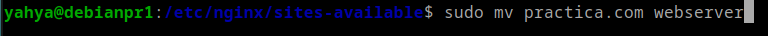


### Cambiamos el puerto en el archivo de conf a 8080:

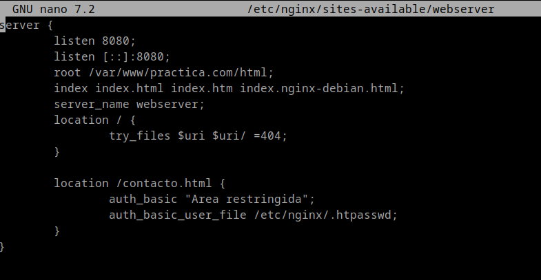


### Borramos el link simbolico antiguo:

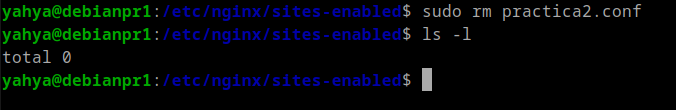


### Creamos uno nuevo:
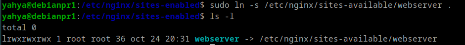

### Reiniciamos nginx comprobando el sintaxis del conf antes:

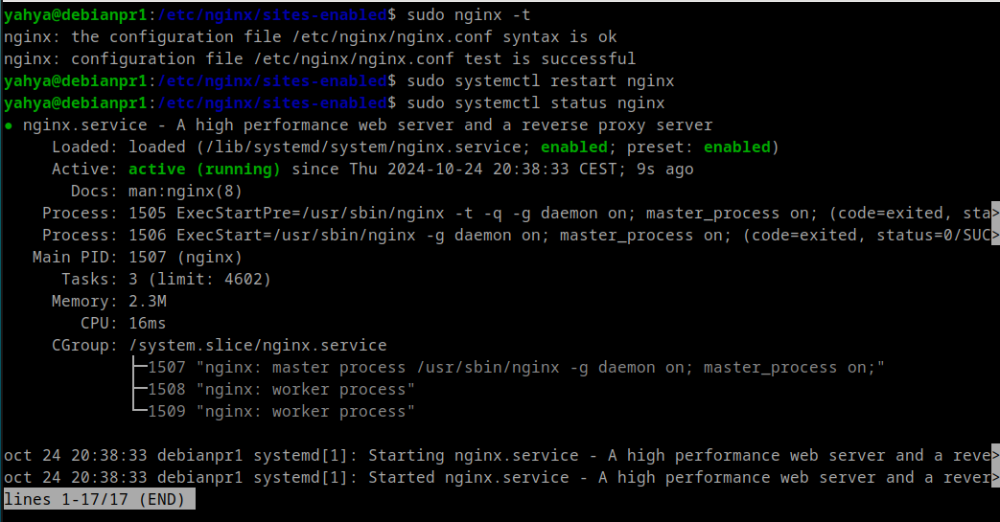 <br>


### Configuramos el archivo de conf de Proxy
- El puerto: 80
- Y ponemos para que dirige la petición a nuestro servidor web ```webserver```
<br>

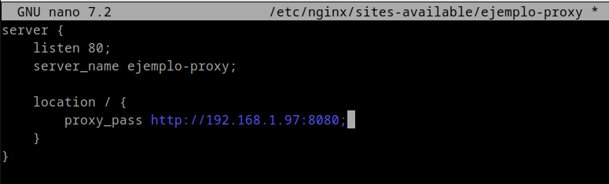

### Creammos un link simbolico a site-enabled para habilitar la configuracion

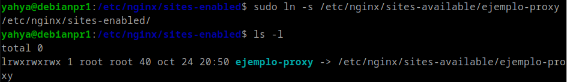


### Reiniciamos nginx:

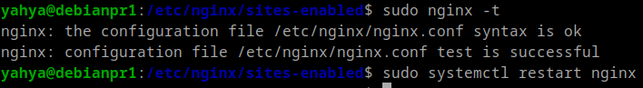


### Configuramos el **hosts** de la máquina anfitriona poniendole la ip de la máquina del proxy y el puerto 80 por defecto  


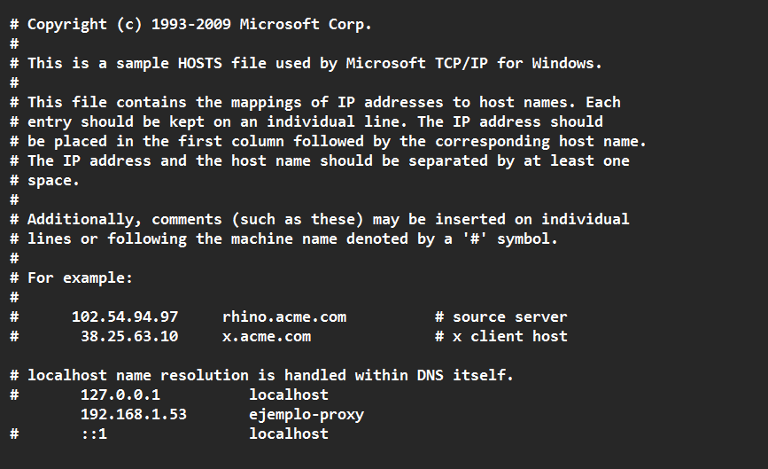

## **Cabezeras**

* Ahora ya al acceder a nuestro servidor a través del navegador nos salen las cabezeras, y apreciamos que Remote address tiene como ip, la del Proxy, lo que significa que todo funciona como debe de funcionar.

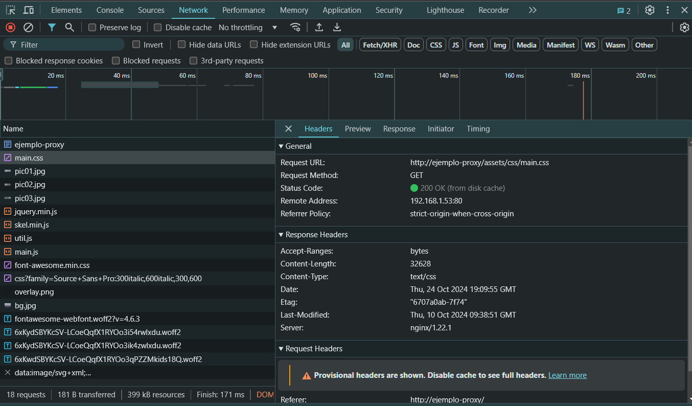


### Cabecera Host en Proxy

* Vamos a ponerle una cabezera hosts a nuestro proxy que será ```Proxy_inverso_yahya```

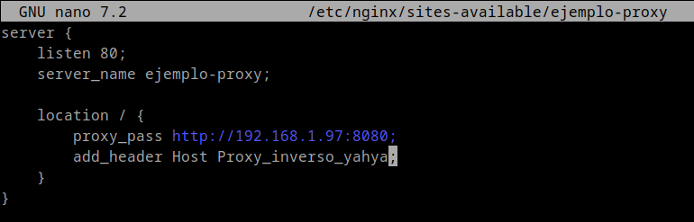

                                     
### Cabezera Host en Webserver

* Hacemos lo mismo para el servidor web poniendole ```webserver``` 

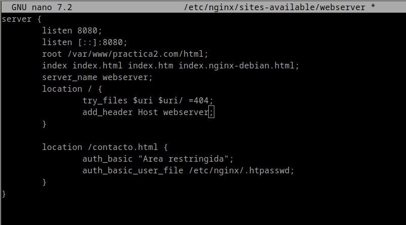

###  Y ahora ya se ven las cabezeras ```Host``` de los 2 servidores [Proxy, Web]

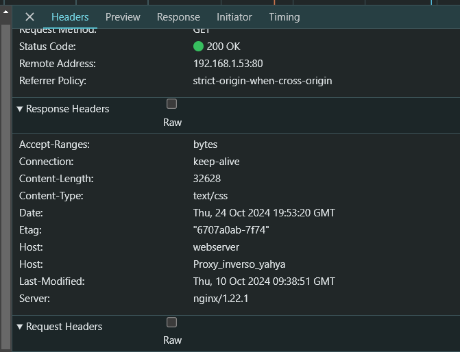
